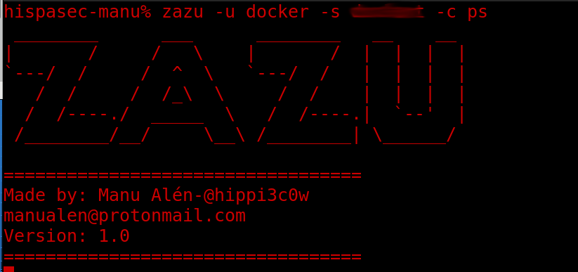
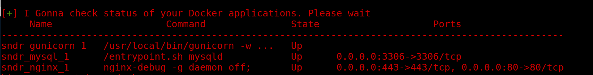

# ZAZU
Zazu is a free tool that can be used to monitoze Docker applications if in the remote server we have added ssh keys to guarantee security and that only sysadmins can use with the correct servers.

The usage is the following
 - u: Used to specify a valid user in remote server
 - s: Used to specify the remote server
 - c: Used to specify the docker-compose command to exeute in remote server
 
```Examples:
zazu -u me -s server -c ps
```




# Features
 - Monitorize if Docker containers are up or not
 - Watch docker conrtainer logs
 - Security due to you must use ssh keys to a better usage
 
# Install

```
git clone https://github.com/hippi3c0w/zazu.git
cd zazu
cp -pv zazu /usr/bin
```
or you can use ***partera*** software

```
partera -u hippi3c0w -r zazu
```

# Disclaimer
It only can be use in GNU/Linux distros
